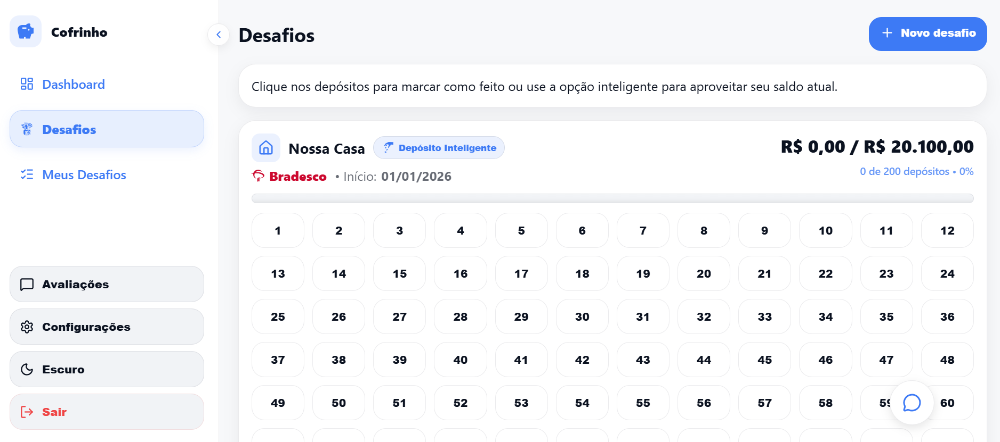

# 🐷 Cofrinho - Desafios Financeiros Inteligentes



Bem-vindo ao **Cofrinho**, uma aplicação web progressiva (PWA) moderna projetada para transformar a maneira como você e seus parceiros gerenciam economias e desafios financeiros. Combinando estética premium, gamificação e funcionalidades sociais, o Cofrinho torna o hábito de poupar viciante e organizado.

## 🚀 Funcionalidades Principais

### 💼 Gestão de Desafios (Investimentos)
- **Criação de Metas:** Crie "Desafios" personalizados com metas de valor.
- **Depósitos Inteligentes:** Acompanhe o progresso com uma interface visual rica e interativa.
- **Edição Flexível:** Ajuste valores, adicione ou remova depósitos facilmente.
- **Categorização:** Organize seus desafios por ícones de bancos e instituições financeiras.

### 👥 Funcionalidades Sociais & Admin
- **Chat Privado em Tempo Real:** Canal exclusivo de comunicação entre Sócios e Admins.
  - 🔔 Notificações instantâneas (Toasts).
  - 🔴 Contador de mensagens não lidas (Badge).
  - 🗑️ Exclusão de mensagens para ambos os lados.
- **Sistema de Feedback:** Usuários anônimos ou logados podem enviar avaliações, visualizáveis apenas para administradores.
- **Gestão de Usuários:** Controle de acesso baseado em emails (Admin/Sócio).

### 🎨 Experiência de Usuário Premium
- **Glassmorphism UI:** Design moderno com efeitos de vidro, desfoque e transparência, inspirado nos melhores apps fintech.
- **Dark/Light Mode:** Alternância de tema fluida com persistência de preferência e adaptação automática de cores.
- **PWA (Progressive Web App):** Instalável em dispositivos móveis como um aplicativo nativo.
- **Responsividade Total:**
  - **Desktop:** Sidebar colapsável com animações suaves.
  - **Mobile:** BottomBar com design "Notched" e botão de ação flutuante centralizado.

## 🛠️ Stack Tecnológica

O projeto foi construído utilizando as tecnologias mais modernas do ecossistema React:

- **Core:** [React 19](https://react.dev/) + [Vite](https://vitejs.dev/)
- **Estilização:** [Styled Components](https://styled-components.com/) (CSS-in-JS)
- **Backend/Database:** [Firebase](https://firebase.google.com/) (Firestore, Auth, Storage)
- **Ícones:** [Lucide React](https://lucide.dev/) & [React Icons](https://react-icons.github.io/react-icons/)
- **Gráficos:** [Recharts](https://recharts.org/)
- **Notificações:** [React Toastify](https://fkhadra.github.io/react-toastify/)

## 📂 Estrutura do Projeto

```bash
src/
├── components/      # Componentes reutilizáveis (Cards, Modais, ChatWidget)
├── context/         # Gerenciamento de estado global (Auth, Theme, Data)
├── pages/           # Telas principais (Dashboard, Login, Desafios)
├── services/        # Configuração e serviços do Firebase
├── styles/          # Definições globais de estilo (GlobalStyles) e temas
├── ui/              # Componentes estruturais de layout (Sidebar, BottomBar, Layout)
└── utils/           # Funções auxiliares, formatadores e constantes
```

## 🚀 Como Rodar o Projeto

### Pré-requisitos
- Node.js (v18+)
- NPM ou Yarn

### Instalação

1. Clone o repositório:
```bash
git clone https://github.com/DevGabriel0402//desafio-do-deposito.git
cd cofrinho
```

2. Instale as dependências:
```bash
npm install
```

3. Configure as Variáveis de Ambiente:
Crie um arquivo `.env` na raiz do projeto com suas credenciais do Firebase e configurações de administrador:

```env
# Firebase Configuration
VITE_FIREBASE_API_KEY=sua_api_key
VITE_FIREBASE_AUTH_DOMAIN=seu_projeto.firebaseapp.com
VITE_FIREBASE_PROJECT_ID=seu_projeto
VITE_FIREBASE_STORAGE_BUCKET=seu_projeto.appspot.com
VITE_FIREBASE_MESSAGING_SENDER_ID=seu_sender_id
VITE_FIREBASE_APP_ID=seu_app_id

# Admin & Socio Configuration
VITE_EMAIL_ADMIN=seu-email@admin.com
VITE_EMAIL_SOCIO=email-socio@exemplo.com
VITE_NOME_ADMIN=nome do administrador
VITE_NOME_SOCIO=nome do socio
```

4. Rode o servidor de desenvolvimento:
```bash
npm run dev
```

Acesse `http://localhost:5173` no seu navegador.

## 🔒 Segurança & Acesso

- **Rotas Protegidas:** O acesso ao dashboard e dados financeiros é restrito a usuários autenticados.
- **Modo Anônimo:** Visitantes podem testar as funcionalidades do app por 5 minutos via login anônimo (dados apagados automaticamente após expiração).
- **Controle de Chat:** O widget de chat é montado condicionalmente apenas para os emails definidos nas variáveis de ambiente.

---
Desenvolvido com 💙 para gestão financeira inteligente.
